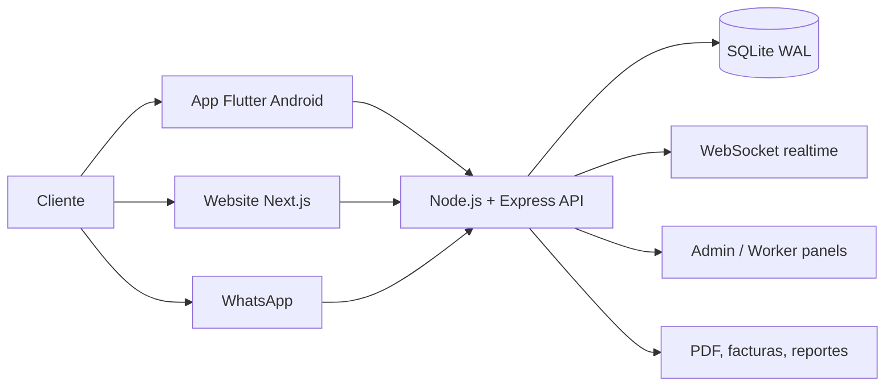

<div align="center">

# 🛒 Supermercados Go

### Plataforma full-stack para supermercados: app móvil, website, API, paneles operativos y automatización.

[](https://git.io/typing-svg)


</div>

---

## Visión

**Supermercados Go** convierte la operación diaria de un supermercado en una plataforma digital integrada:

- clientes compran desde app móvil o website;
- trabajadores preparan pedidos, gestionan rutas y registran entregas;
- administradores controlan inventario, proveedores, promociones, facturas y reportes;
- el backend centraliza datos, seguridad, WebSocket, archivos, mensajería y automatizaciones.

> Estado técnico actual: el website compila correctamente con `next build`, el backend pasa validación sintáctica con `node --check`, y esta versión fuente no incluye tests Jest activos.

## Arquitectura



## Módulos principales

| Módulo | Ruta | Rol |
|---|---|---|
| API principal | `server/` | Autenticación, productos, pedidos, inventario, facturas, usuarios, reportes y WebSocket. |
| Website público | `website/` | Landing/e-commerce en Next.js 14 con Tailwind. |
| App Android | `app/` | Cliente, trabajador y administrador en Flutter. |
| Panel admin web | `admin-panel/` | Operación administrativa desde navegador. |
| Panel trabajador | `worker-panel/` | Flujo operativo para preparación/entrega. |
| Dashboard Python | `dashboard/` y `dashboard.py` | Panel operativo local. |
| Infraestructura | `Dockerfile`, `docker-compose.yml`, `nginx.conf`, `deploy-linux.sh` | Despliegue Linux/Docker/nginx/systemd. |

## Funcionalidades

### Cliente

- Catálogo, búsqueda, favoritos y carrito.
- Checkout, direcciones, promociones y seguimiento de pedido.
- Notificaciones, historial, facturas y calificación de pedidos.

### Trabajador

- Pedidos asignados y disponibles.
- Picking, sustituciones, ruta, prueba de entrega y caja.
- Panel de ganancias y estado operativo.

### Administrador

- Dashboard, usuarios, categorías, productos y banners.
- Inventario, kardex, compras, proveedores y stock.
- Facturación, reportes PDF, promociones, fidelización y auditoría.

### Backend

- API REST con JWT, validación, seguridad HTTP y rate limiting.
- Base de datos SQLite en modo WAL.
- WebSocket para eventos en tiempo real.
- Servicios para inventario, facturas, lealtad, notificaciones, PDF y WhatsApp.

## Inicio rápido

### Backend

```bash
cd server
cp .env.example .env
npm ci
npm run migrate
npm run dev
```

Servidor por defecto: `http://localhost:3777`

### Website

```bash
cd website
npm ci
npm run build
npm run dev
```

### App Android

```bash
cd app
flutter pub get
flutter build apk --release
```

También puedes usar:

```bash
./compilar-apk.sh
```

## Variables de entorno

La plantilla está en [`server/.env.example`](server/.env.example). No subas `.env`, bases de datos locales ni keystores.

Variables críticas:

| Variable | Uso |
|---|---|
| `JWT_SECRET` | Firma de tokens. Debe ser fuerte y único por entorno. |
| `API_KEY` | Clave interna/API. No usar valores de ejemplo en producción. |
| `DB_PATH` | Ruta de SQLite. |
| `CORS_ORIGINS` | Orígenes permitidos. No usar `*` en producción. |
| `SMTP_*` | Correo transaccional opcional. |
| `WA_*` | Integración WhatsApp opcional. |

## Validación local

Checks ejecutados sobre esta actualización:

```bash
cd website && npm ci && npm run build
find server/src -name '*.js' -print0 | xargs -0 -n1 node --check
```

Resultado:

- Website: build de producción exitoso.
- Server: sintaxis JavaScript válida.
- Tests: `npm test` no encuentra tests porque la carpeta fuente actual no incluye archivos `*.test.js` / `*.spec.js`.
- Auditoría npm: durante instalación del server se reportaron 2 vulnerabilidades; revisar con `npm audit` cuando la red esté estable.

## Despliegue

### Docker

```bash
docker-compose up -d
docker-compose logs -f
```

### Linux

```bash
chmod +x deploy-linux.sh
./deploy-linux.sh
```

Incluye configuración para nginx, systemd/fail2ban según los scripts del proyecto.

## Estructura

```text
supermercado-go/
├── server/              # API Express + servicios + migraciones
├── website/             # Next.js 14 + Tailwind
├── app/                 # Flutter Android
├── admin-panel/         # Panel administrativo web
├── worker-panel/        # Panel operacional
├── dashboard/           # Dashboard Python
├── docs/                # Planes/especificaciones internas
├── docker-compose.yml
├── nginx.conf
├── deploy-linux.sh
└── compilar-apk.sh
```

## Seguridad operativa

- Mantén `.env`, bases de datos, backups, APKs y keystores fuera de Git.
- Cambia `JWT_SECRET` y `API_KEY` por valores aleatorios antes de desplegar.
- Revisa dependencias con `npm audit`.
- Usa HTTPS, CORS explícito y backups cifrados en producción.

## Repositorio

Repositorio público: <https://github.com/itanmidnight-ux/supermercado-go>
